# DSH Vibeify

**A generative-AI harness that feels like a living website. DeepSeek, ChatGPT, or both.**


[Visit the DSH Vibeify information and download site](https://dsh-vibeify.ezzye.chatgpt.site) · [See how it works](docs/HOW_IT_WORKS.md) · [Read the installation guide](docs/INSTALL.md)

DSH Vibeify's magazine is **not** a public website. It turns [DeepSeek Harness](https://github.com/deepseek-ai/deepseek-harness)—a local runtime for agents, models, tools, permissions and sessions—into a creator-first streaming experience that *behaves* like a website. Vibe is the visual, content-first home; Chat remains underneath for detailed requests, progress, approvals, Queue, Steer and technical evidence. An optional, deliberately separate share service can publish one reviewed article at a time without exposing the local magazine or requiring the recipient to have DSH, ChatGPT, or DeepSeek.

## The idea: generative AI beyond turn-by-turn chat

Most AI products begin with an empty box. The person writes a prompt, waits for one answer, and repeats. DSH Vibeify begins with something useful to explore and turns Chat work from any thread into one continuous edition. For an explicit public-content request, each complete verified card can arrive while the rest of the answer is still being made; ordinary final answers join after completion. It generates extra magazine material only when the reader asks for an update.

```mermaid
flowchart LR
    OPEN["Open local DSH"] --> VIBE["Vibe already contains a visual edition"]
    VIBE --> EXPLORE["Read · watch · save · respond"]
    RADAR["Shared public radar\ntrends · culture · technology"] --> CACHE["Local hidden reserve\nsignals · candidates · ready pages"]
    CACHE --> VIBE
    EXPLORE --> SIGNAL["A Chat request, pull-to-update, or Update click"]
    SIGNAL --> HARNESS["DSH harness\nsessions · tools · models · permissions"]
    HARNESS --> LEAD["Active lead agent\nplans and defines acceptance"]
    LEAD --> INSTANT["Local reserve\nready pages + visual short + questionnaire"]
    LEAD --> WORK["Independent specialist lanes\nquick · culture · media · deep"]
    WORK --> CHECK["Lead verifies each finished lane independently"]
    CHECK --> STREAM["Each closed editorial chunk streams immediately"]
    INSTANT --> VIBE
    STREAM --> VIBE
    STREAM --> STOP["One bounded update completes, then stops"]
    VIBE --> PREVIEW["Share one article\nprivate preview first"]
    PREVIEW -->|"reader presses Publish"| PUBLIC["Public article link\nno DSH account required"]
    EXPLORE -. "open when you want control or detail" .-> CHAT["Chat\nask · queue · steer · approve · inspect"]
    CHAT --> HARNESS
```



The visible surface is website-like, but the machinery underneath is an agent harness:

| Layer | What it does |
| --- | --- |
| **DSH** | Runs sessions, agents, model routes, tools, permissions and approvals on the user's machine. |
| **Vibeify** | Adds the continuous editorial stream, visual presentation, local content buffer and safe route between generated work and the stream. |
| **Vibe** | Presents every thread's completed answers—and complete verified cards from an active public-content request—as one newest-first edition. A hidden local reserve may be prepared while Vibe is in recent use; only Pull to update, Update, a closed public-content card, or a completed Chat answer changes the visible magazine. It is not a separate public site. |
| **Chat** | Lets the user ask directly, queue or steer work, approve protected actions and inspect progress or technical evidence. |
| **Lead agent** | Plans, sets the acceptance bar, validates work and owns the final result. This is Codex in governed ChatGPT/combined mode, or the native DSH agent in DeepSeek-only mode. |
| **Workers** | Optionally perform bounded research, coding, analysis or media work; their output is not published merely because they say it is finished. |
| **Optional share service** | Receives one allow-listed, reader-reviewed article only after **Share** is clicked, shows a private preview, and performs a public write only after a second **Publish public link** click. It never receives the Chat prompt, reasoning, session identity, settings, local history, or credentials. |

“Streaming” here means a continuous stream of **complete, formatted content items**, not merely text appearing token by token. The edition is available immediately from local bundled, saved, and ready-reserve material. A deliberate pull or Update click releases ready pages immediately, including visual and questionnaire formats, then uses one foreground batch only when the reserve is short. During an explicit public-content Chat request, the first short verified card arrives before the whole series is researched and each later closed card follows independently; ordinary un-enveloped final answers join after durable completion. Neither route makes an extra AI call. Opening, scrolling, changing settings, or finishing a batch never changes the visible edition by itself.

This is the different paradigm: **Chat is an available control surface, not the whole product.** Each Chat thread remains request-driven and becomes idle after it answers. Vibe is the shared presentation layer across those threads, with an explicit update gesture when the reader wants more.

For a plain-English walkthrough of the two surfaces, instant local reserve, parallel agent lanes, complete-page streaming, stop conditions, provider modes, and privacy boundary, read [How DSH Vibeify works](docs/HOW_IT_WORKS.md).

Choose the provider setup that suits you:

- **DeepSeek only:** native DSH/DeepSeek runs the agent and the provider-neutral Vibe package supplies the experience.
- **ChatGPT only:** a ChatGPT-authenticated Codex agent leads and works without an OpenAI API key.
- **Both (recommended governance mode):** Codex plans, manages, verifies, integrates, and answers while DeepSeek performs eligible bounded execution.

Neither account is individually compulsory, and installation can finish before either is connected. At least one working provider is required before asking the agent to perform AI work. DeepSeek billing and ChatGPT plan limits remain separate.

The first screen is Vibe itself: a full-screen editorial feed is already populated from a bundled well and the reader's saved magazine. No guide, tile, recipe, or prompt must be selected. Ordinary answers from all local DSH threads arrive at the top after their turns finish successfully. Explicit public-content requests may add each complete verified card while the source turn is still working. **Chat** remains the detailed source view with the conventional DSH conversation and technical controls.

> DSH is a fast-moving developer preview. Vibeify pins the versions it has tested and includes a health check, but you should still expect upstream changes.

## Start here

### I am curious, but not a developer

Think of DSH as a control room for AI agents. DSH Vibeify changes that control room in three important ways:

1. **The product starts with content, not a task form.** Read, scroll, save, watch, listen, or answer an optional question; open Chat only when you want to make or solve something.
2. **Every tile is visual.** A stable locally bundled photograph is available without a model or network wait. Generated magazine pages require subject-relevant public photography, long features can carry several photographic beats, and occasional AI-assisted graphics remain explicitly labelled.
3. **Provider choice is real.** DeepSeek, ChatGPT, and combined Codex-led governance are separate install modes rather than one account being hidden as a requirement.

It does not switch provider mode without telling you, send your images elsewhere, approve emails or other external actions for you, or promise equivalent quality where no Codex verification step is present.

### I want to try it

For the friendly macOS route, [download the installer](https://dsh-vibeify.ezzye.chatgpt.site/DSH-Vibeify-Installer-macOS.zip), unzip it, and open **Install DSH Vibeify.command**. It installs or updates DSH and Vibeify, lets you choose DeepSeek, ChatGPT, both, or later, runs checks, and opens DSH. It never asks for an API key.

For the developer route you need Node.js 22 or newer and Git:

```bash
git clone https://github.com/N9-Developer-Empowerment/DSH-Vibeify.git
cd DSH-Vibeify
./scripts/install-dsh.sh --latest
./scripts/install-vibeify.sh --provider deepseek   # or chatgpt / auto
./scripts/doctor.sh
dsh web
```

The installer does not restart a DSH process that is already running. Finish active work first. If DSH is already open on port 3080, reuse that page instead of starting a second copy.

For screenshots, alternative profiles, DeepSeek credentials, updating, migration, and removal, read the [full installation guide](docs/INSTALL.md). For the product lifecycle before or after installation, see [How it works](docs/HOW_IT_WORKS.md).

## What you get

- **A continuous editorial website.** Vibe covers the DSH work surface completely and opens directly into one long, responsive edition. There is no catalogue-to-player-to-result transition.
- **A deep local well.** Twenty-four deterministic editorial chunks—text, credited photography, AI-assisted graphics, and questionnaire cards—are available synchronously on a cold visit. Every tile receives one of twelve bundled visuals with varied crop and treatment, later images decode lazily, and up to 160 completed magazine items persist for return visits.
- **Instant, bounded updates.** Pull down from the top of Vibe—including a two-finger pull on a Mac trackpad—or choose **Update**. Ready pages are released from the hidden reserve synchronously; a local visual short and questionnaire ensure an immediate response even when the reserve is empty. If fewer than four ready pages exist, one bounded foreground batch fills the gap and streams complete pages independently. **Stop update** cancels only that dedicated foreground turn, and a 20-minute ceiling stops a stuck update.
- **A shared radar, private editing.** A transparent GitHub Action publishes a public, content-only trend catalogue every 30 minutes. It contains headlines, links, regions and broad tribe hints—never reader history. Each installation keeps its selected tribes, free-text editor note, interactions, questionnaire answers, candidates, ready pages and spending ledger in that browser.
- **A deliberately overstocked reserve.** While the browser is open, Vibe was used within 24 hours, background editing is enabled, and the local ready reserve is below target, a separate hidden editor may prepare 6–8 pages. Combined mode asks bounded DeepSeek Flash workers to do most discovery and drafting while Codex verifies; native mode keeps its distinct no-Codex-verification boundary. The conservative reservation ledger hard-stops at the chosen daily maximum, never above **US $2**.
- **Newest-first, append-only depth.** Fresh chunks join the top of the same edition while storage remains append-only. They never replace earlier material; deeper research becomes a visible editorial follow-up above the earlier page.
- **Questionnaires are content.** One-tap cards create useful engagement time and softly shape later selection. Saves, opens, plays and deliberate skips also teach the local editor; the learning record stays on-device and has a one-click reset.
- **One magazine across every real Chat thread.** Vibe passively follows ordinary reader sessions for complete verified `chat-` cards, then reads durable DSH history as the fallback and for un-enveloped final answers. It never reopens or resumes a thread. Internal subagents, the dedicated foreground update and the hidden background editor are never mistaken for reader conversations. Transport envelopes are removed during cache migration; card titles are not repeated in their bodies, and Markdown tables remain structured. Raw prompts, half-written envelopes, worker reports, candidate lists, attachments, reasoning, tool activity, approvals, session identifiers, aborted work and incomplete progress are never copied.
- **No empty wait or hidden work.** Bundled and saved content render in the first local frame. A content-free ledger measures first frame, restore, explicit updates, chunk arrival, and engagement. Simply reading the magazine consumes no model quota.
- **Real photography, labelled AI graphics.** Six locally bundled photographs and six labelled local AI-assisted SVG compositions provide a zero-wait offline fallback; they are not the live editorial catalogue. Every generated non-questionnaire page begins with verified subject-relevant public photography, while features above 500 words may show two or three separately credited photographs. Each batch considers at least 18 potential images from three or more credible source families, ranks exact subject/entity relevance, informative value, credit clarity, composition, freshness and recent-use diversity, and publishes only the best choices. AI graphics are occasional, story-specific and labelled—never generic documentary substitutes. The browser accepts reviewed catalogue hosts or a direct first-party image paired with a separate official page on the exact same HTTPS host; arbitrary third-party images stay blocked. It remembers 80 recently used remote image URLs, suppresses referrer data, removes rejected image syntax from article prose, and falls back locally if a remote image fails. Saved cards—including their visual provenance—age out with the bounded 30-day/160-item magazine cache.
- **Useful exits from every panel.** Visual credits stay attached to their images. Every generated non-questionnaire panel carries a separate, relevant content destination in the article copy—for example the story, original work, official creator page, paper, video, music or useful service—and Vibe repeats that destination as a compact **Read source** action. Image files and visual-credit pages are never presented as the article link.
- **Review before sharing.** Every finished non-questionnaire card has **Preview and share**. It opens the fixed first-party share origin, waits for an exact-origin handshake, and transfers only that card's title, rendered Markdown, selected public images, credits, source link, kind, and publication time. The preview cannot publish automatically: the reader must inspect it and choose **Publish public link**. Recipients need no AI account. See [Sharing one Vibe article](docs/SHARING.md).
- **Provider-neutral Vibe.** `dsh-vibeify-experience` supplies Vibe without installing a Codex provider, so native DSH/DeepSeek remains in control.
- **Optional governed mode.** `dsh-vibeify` uses ChatGPT-authenticated Codex and deliberately removes OpenAI API-key fallbacks from the child process. In this mode Codex remains the lead.
- **DeepSeek-first execution.** Flash handles routine bounded work by default, while Pro is reserved for packets where harder reasoning reduces rework. Experimental Vision remains explicit opt-in for current images.
- **A quality gate, not blind trust.** Every worker receives a Codex-defined acceptance contract and evidence request. Worker prose is never accepted on its own: Codex validates artifacts, tests, or cited evidence before integration.
- **A Codex capability setting.** Open **Settings → Codex** to choose Efficient, Balanced, Frontier, or Maximum. Frontier—GPT-5.6 Sol with Extra High reasoning—is the quality-preserving default.
- **A safe update centre.** Open **Settings → Updates** to check the installed DSH, Vibeify, and bundled Codex agent separately. A newer Codex release is not labelled installable until Vibeify has qualified it. **Download safe updater** opens the friendly Mac updater, which installs immutable packages and asks before a detached, verified restart.
- **Clearer live work.** Chat receives useful progress, Queue or Steer controls remain available while the agent is busy, and explicit magazine updates or public-content requests can publish closed, source-checked chunks into Vibe without exposing reasoning or raw worker prose. Vibeify opens the current Think disclosure while work is live, then closes that same disclosure once when the final answer settles; the reader can reopen it without the interface fighting back.
- **Fewer unnecessary prompts.** Full local access avoids repeated shell approvals while protected external writes still require confirmation.
- **Connected Codex apps.** Installed tools can be surfaced through their normal Codex approval boundaries; desktop-only capabilities still require the appropriate host connection.
- **Image support.** Images can be uploaded to Codex; sending them to another provider always requires explicit intent.
- **Colour and editorial settings.** In Chat, **VIBE settings** combines colour themes with any mix of 15 broad audience lenses—from Global & curious, Gen Z and Builders & nerds to Culture & arts, parents, sport and local life. It also controls useful surprise, a free-text editor note, background reserve filling, gentle content notes and a clearly denominated **USD/day** DeepSeek maximum. Colour remains presentation-only; editorial settings never change permissions or protected-action approval.

## What “lower cost without lower quality” means in combined mode

Codex cannot see the exact quota remaining on your ChatGPT plan. Vibeify therefore does not wait for a quota alarm. It reduces lead-agent consumption structurally: Codex spends its capability on planning, routing, judgment, validation, and the final result, while DeepSeek performs most eligible execution work.

Codex sends one or more well-defined execution packets to a cheaper worker when:

- the task is self-contained;
- its result can be checked independently;
- the selected model has the right capability; and
- the same acceptance bar can be maintained.

Codex does not simply ask whether the worker says it succeeded. It inspects the actual diff, files, test results, sources, or other task evidence. Passing work is reused; Codex repairs only failed or unverifiable parts instead of pointlessly repeating everything.

No system can promise identical quality on every unseen task. Vibeify preserves the quality *process*: the default Codex lead remains the frontier preset, acceptance criteria do not change, and unverifiable work stays with or returns to Codex. Choosing a lower Codex capability level is an explicit user trade-off and should be evaluated on representative work.

DeepSeek API calls are billed separately by DeepSeek. Pricing and model availability change, so the live DSH catalogue is consulted before making cost claims.

## Experience Shell and VIBEs

The **Vibe home** owns one lean-back magazine, saved chunks, questionnaire cards, completed-Chat projections from every local thread, live complete cards from explicit public-content requests, update controls, and reading position. It is the landing page on every visit; a previous Chat visit is not restored as home. **Chat** reveals the normal DSH conversation, **Trajectory** retains technical work, and **Vibe** returns to the top of the newest-first edition. Completed answers and explicitly published chunks are retained in a bounded 30-day browser-local cache; prompts, session ids and working activity are not. The uppercase **VIBE settings** control remains separate: colour affects Chat presentation, while editorial direction affects only the next requested magazine update. Neither changes models, permissions, routing, protected-action confirmation, or billing policy. In DeepSeek-only mode, Codex-specific capability and progress controls are omitted. See [Vibe generated-content streaming](docs/CONTENT_STREAMING.md) for the lifecycle, live semantic-card route, local-history fallback, cache, timing, chunking, and worker method.

Select **Chat**, then **VIBE settings** at the bottom-right of the conventional DSH UI to choose a colour palette, a broad editorial direction, and an optional free-text editor note. These settings are stored only in that browser; the direction is passed to the lead only when you next pull to update or choose **Update**. Select the visually highlighted **Vibe · Magazine** session tab to return directly to the newest material.

Daniela Elliott leads the project’s experience design, look and feel, and visual VIBEs. The current palettes are a starting point for a more expressive, user-shaped agent workspace. See [VIBEs](docs/VIBES.md) to add or refine a palette.

## For developers

DSH Vibeify is both a real DSH bundle and a Codex helper plugin:

```text
DSH-Vibeify/
├── .agents/plugins/marketplace.json   # repository Codex marketplace
├── docs/                              # installation, design and security
├── plugins/dsh-vibeify/
│   ├── .codex-plugin/plugin.json      # Codex plugin manifest
│   ├── cordis.patch.yml               # DSH bundle configuration
│   ├── index.js                       # Codex adapter and worker routing
│   ├── codex-capability.js            # lead capability presets
│   ├── codex-settings.js              # live DSH settings integration
│   ├── delegation-contract.js         # worker/acceptance boundary
│   ├── progressive-output.js          # live final-answer delta bridge
│   ├── update-check.js                # fixed-source version and compatibility checks
│   ├── client-src/experience/         # stream shell, playout, cache, timing and catalogue modules
│   ├── preview/                       # isolated visual iteration harness
│   ├── client.js                      # generated DSH browser artifact
│   └── skills/dsh-vibeify/SKILL.md    # Codex operational guidance
├── plugins/dsh-vibeify-experience/    # provider-neutral DSH client package
├── services/vibe-share/               # optional account-free public article host
├── shared/vibe-share-contract.js      # allow-list boundary shared by DSH and host
└── scripts/                            # installer, migration and doctor
```

The bridge currently pins:

- `@deepseek-ai/dsh` `0.1.1-rc.2`
- `@openai/codex` `0.147.0`
- DSH Vibeify `0.14.0`

Before changing authentication, approvals, routing, image transfer, external actions, or provider behavior, read [Architecture](docs/ARCHITECTURE.md), [Security and billing](docs/SECURITY.md), [Contributing](CONTRIBUTING.md), and [AGENTS.md](AGENTS.md).

Run the source checks with:

```bash
./scripts/doctor.sh --source
```

For visual iteration without restarting DSH:

```bash
cd plugins/dsh-vibeify
npm install
npm run build:preview
python3 -m http.server 4173 --directory ../../tmp/vibeify-preview
```

The release workflow also runs the Codex plugin validator, skill validator, package dry-run, isolated DSH composition, and server-start smoke test.

## Install the Codex helper plugin

This optional step teaches Codex how to install and diagnose DSH Vibeify. It does not itself install the DSH runtime bundle.

```bash
codex plugin marketplace add /absolute/path/to/DSH-Vibeify
codex plugin add dsh-vibeify@dsh-vibeify
```

Start a new Codex task after installation so the helper skill is discovered cleanly.

## People

- **Errol Elliott** — agent architecture, integration, and product direction
- **Daniela Elliott** — experience design, look and feel, and visual VIBEs

Contributions are welcome. DSH Vibeify is an independent community project and is not an official DeepSeek or OpenAI product.

## Upstream references

- [DeepSeek Harness](https://github.com/deepseek-ai/deepseek-harness)
- [DSH plugin packaging](https://github.com/deepseek-ai/deepseek-harness/blob/master/docs/user/develop/basic/publish.md)
- [OpenAI Codex plugin documentation](https://learn.chatgpt.com/docs/build-plugins)
