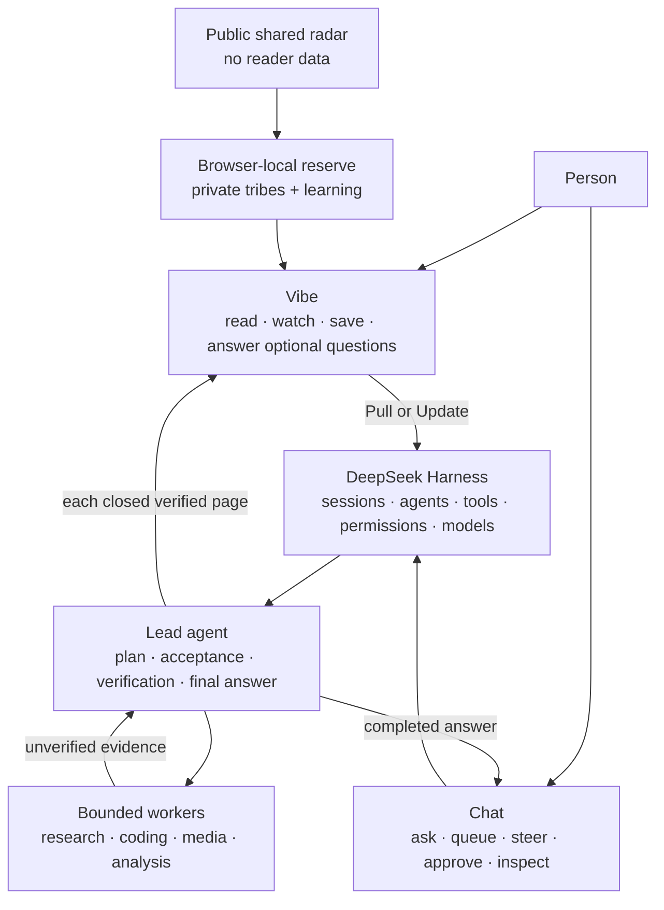
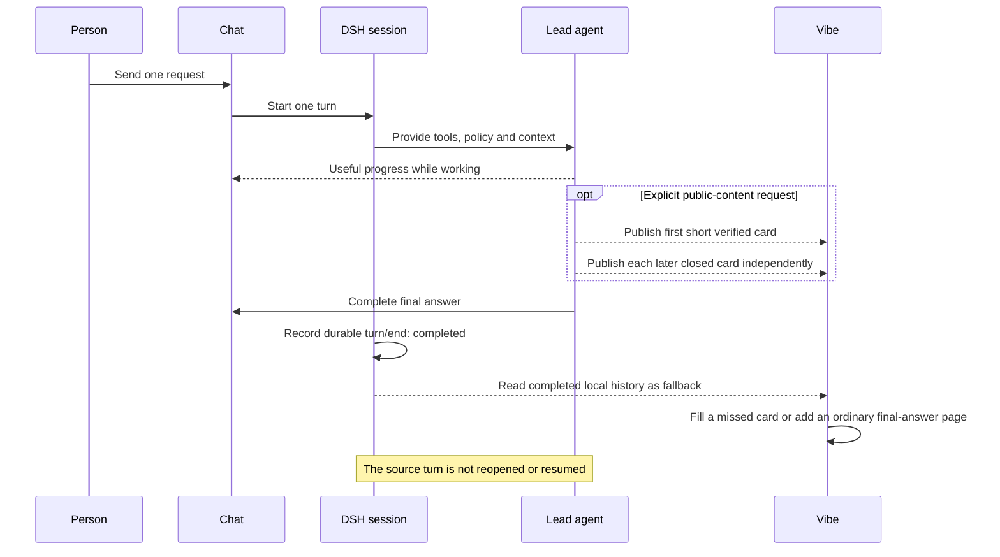
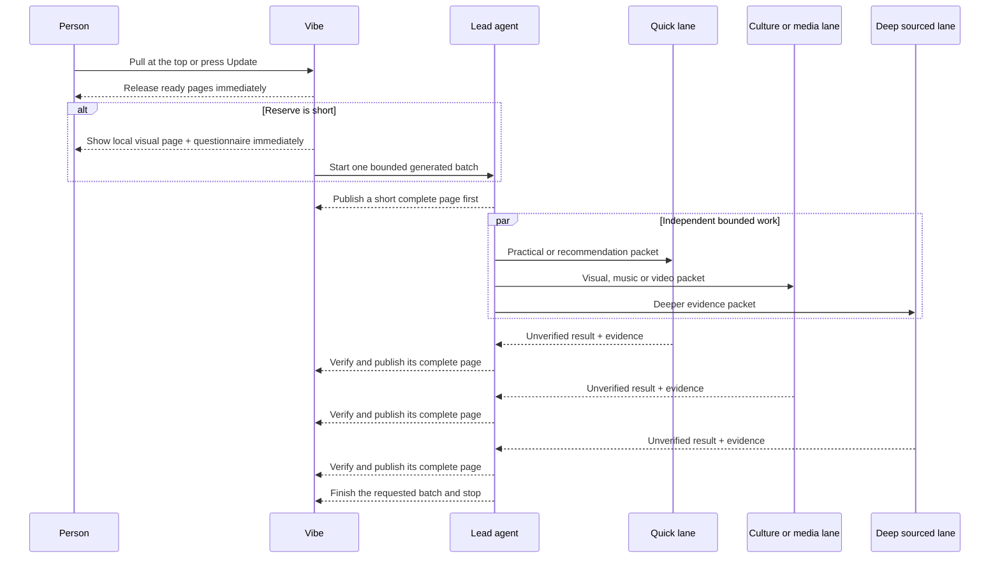

# How DSH Vibeify works

DSH Vibeify is a local agent harness presented as a living magazine. It is not a public website and it is not a chatbot that quietly runs forever. The visible **Vibe** surface is a browser-local edition; **Chat** is the control surface where a person asks for work, follows progress, steers it, and approves protected actions.

## The short version

Think of it as a small editorial studio:

- **Vibe is the magazine.** It opens with useful visual material already available from a local content well and the reader's saved edition.
- **Chat is the commissioning desk.** A request starts one agent turn. Its completed answer remains in Chat. For an explicit public-content request, each complete verified card may also appear in Vibe before the whole answer is finished.
- **A public radar watches the world, not the reader.** GitHub publishes a content-only catalogue of current public signals every 30 minutes. It contains no local history or preferences.
- **A local editor quietly prepares options.** When Vibe was used within 24 hours, the tab is open, the reserve is low, background work is enabled and budget remains, a separate hidden session prepares candidates. It never opens or steers an ordinary Chat.
- **Update releases one new edition pass.** Vibe spends ready pages immediately. A local visual page and questionnaire remain the zero-wait fallback; one bounded foreground batch starts only when fewer than four ready pages exist.
- **The lead is the editor.** It plans, divides eligible work, verifies evidence, and decides what is safe and good enough to publish.
- **Workers are contributors.** DeepSeek or another available worker can research or build bounded pieces, but its raw report is never itself a Vibe article.
- **Finished pages stream independently.** A quick page does not wait for a deeper research lane. Each complete, checked page appears as soon as it is ready.
- **The run stops.** One Chat request produces one answer; one Vibe update produces one batch. Neither completion nor ordinary scrolling starts another run.
- **Sharing is a separate deliberate route.** A reader can preview one finished article outside DSH, inspect the exact public copy, and then explicitly publish an account-free link. The rest of the magazine stays local.

## Two surfaces, one harness



DSH remains the runtime underneath both surfaces. It owns the sessions, models, tools, permissions, approvals, and durable event history. Vibeify adds the presentation and the narrow publication rules; it does not bypass DSH.

## What happens when DSH opens

Vibe renders from local material before it needs a model or network request:

1. a bundled 24-item editorial well supplies a useful cold start;
2. up to 160 previously completed Vibe pages are restored from that browser's local cache;
3. the newest material is presented first; and
4. images below the fold load lazily.

Opening Vibe, returning to it, scrolling, reaching the bottom, or changing a colour theme never changes the visible magazine or starts an ordinary Chat turn. When the recent-use, visibility, reserve-capacity and spend gates all pass, the background editor may refresh the hidden reserve; it remains invisible until the reader explicitly updates. Blank-content time is designed to be zero.

## The radar and reserve

The shared radar is deliberately modest: public headline/link signals from reviewed sources, broad geography and broad audience hints. A scheduled GitHub Action rebuilds it every 30 minutes and publishes the JSON openly, so its inputs and output can be inspected. The radar cannot see a reader's chats, saves, questionnaire answers or settings.

Each browser then owns three private layers:

1. **signals** copied from the public radar and expired after seven days;
2. **candidates** prepared by the native provider or bounded worker lanes; and
3. **ready pages** accepted for immediate release in governed mode.

The local editor uses selected audience lenses, a bounded free-text note, explicit saves/opens/plays/skips and questionnaire answers. That learning stays on the device and can be reset. A useful-serendipity control deliberately admits some material outside the selected lenses. The editor's brief is to entertain, educate and inform with freedom, creativity and humour—not to maximise anger.

## What happens after a Chat request



Only two boundaries are eligible: a complete verified `chat-` envelope from an ordinary reader session, or the final assistant output of a durably completed turn. Vibe ignores the raw user prompt, hidden reasoning, tool calls, approvals, attachments, session identifiers, interrupted turns, aborted work, unfinished envelopes, and internal subagent sessions. The original answer stays in Chat; each Vibe page is a bounded browser-local projection of completed semantic material.

## What happens after Pull to update or Update

One deliberate gesture starts exactly one bounded magazine update.



The immediate visual page and questionnaire use no provider call and target a sub-second arrival. Generated work then follows progressively:

1. the lead publishes a small, honest page that does not require fresh research;
2. quick/practical, culture/media, and deeper sourced lanes can run concurrently;
3. each worker returns evidence to the lead, not directly to the reader;
4. the lead verifies each lane independently;
5. each finished page crosses a complete-envelope boundary and appears immediately; and
6. the parent update stops after the requested batch or after its safety timeout.

The browser never publishes half a paragraph or a stream of raw tokens. It waits only for one **complete semantic chunk**—a finished article, recommendation, image page, music or video route, editorial, or questionnaire—then releases that item without waiting for the whole batch.

For visual pages, the editor considers at least 18 potential images from three or more credible source families, then selects for exact subject or named-entity relevance, informative value, clear credit, usable composition, freshness and non-repetition. The displayed image keeps its own creator/source link in the caption. Separately, every generated non-questionnaire page includes a reader-facing content link in the prose; the compact **Read source** action points to that story, work, creator, paper, video, music or useful service—not to the image file or its credit page.

## What runs, and what does not

| Reader action or event | Model work? | Visible result | Stop condition |
| --- | --- | --- | --- |
| Open or return to Vibe | No visible update; hidden reserve work may pass its strict gates | Bundled and saved magazine appears | Immediate local render |
| Scroll or reach the bottom | No | Existing pages continue | No task started |
| Change colour theme | No | Presentation changes | Immediate |
| Change editorial direction | No | Setting is saved for a future update | Immediate |
| Run a public-content Chat request | No additional call beyond that requested Chat turn | Closed verified pages stream independently; final answer stays in Chat | The Chat turn ends |
| Complete any other Chat request | No additional call beyond that requested Chat turn | Final answer stays in Chat and may gain a Vibe page | The Chat turn ends |
| Pull at the top or press **Update** | Usually no new call when at least four ready pages exist | Ready pages immediately; local fallbacks and one foreground batch only if short | One release; any fallback batch has Stop/error/20-minute ceiling |
| Answer a questionnaire, save, open, play or skip | No | The explicit signal is saved locally | It may shape later reserve selection |

Background preparation runs only while the page is open and visible, after Vibe use within 24 hours, with at least six valid radar signals, below the reserve target, and within the configured daily cap. It checks every 30 minutes, uses a dedicated hidden session, reserves at most US $0.25 per run against a hard user-configured ceiling of US $2/day, and has a 15-minute per-run timeout. Turning off **Fill the hidden reserve** pauses it.

## Lead and worker modes

Vibeify supports three provider arrangements:

| Mode | Who leads? | How workers are used |
| --- | --- | --- |
| DeepSeek only | Native DSH/DeepSeek agent | DSH's native agent and approval boundaries apply; no Codex verification claim is made |
| ChatGPT only | ChatGPT-authenticated Codex | Codex plans, executes, verifies and answers |
| Both | Codex | Codex keeps planning and acceptance; DeepSeek performs eligible bounded work when that preserves the same evidence bar |

In combined mode, cheaper execution is not treated as trusted merely because it completed. Codex checks the actual file, diff, test, source, or other required artifact. Passing work is reused; failed or unverifiable work is repaired or rerun. Protected connected-app actions, privacy decisions, final acceptance, and the final answer stay with Codex.

The **Settings → Codex** capability level changes the Codex model and reasoning preset, not this responsibility split. Frontier remains the quality-preserving default.

## How a page crosses into Vibe

Generated pages use one closed transport envelope:

```text
<vibe-chunk id="one-update-unique-id" kind="article" title="A reader-facing title">
Complete Markdown for this one page, with relevant verified links.
</vibe-chunk>
```

The active-run collector accepts only:

- a fully closed envelope;
- an allowed page kind;
- an id belonging to the current update; and
- bounded, sanitized reader-facing fields.

Partial envelopes, raw worker reports, candidate lists, research memos, tool output, another run's pages, and ordinary update summaries are rejected. Persisted session history provides a lossless fallback if the live local event stream disconnects.

## Local storage and privacy

The magazine cache stays in the current browser. It retains only presentation data: a local or hashed id, page kind, source class, title, bounded Markdown, optional catalogue topic, broad selected tribe ids, publication time, and up to 32 visible questionnaire choices. The separate reserve stores only public radar signals, bounded candidate/ready pages, recent-use time and a daily spend ledger. Local learning stores only explicit interaction type, bounded page id/kind, broad tribe ids, visible questionnaire label and time.

It does not store raw prompts, DSH session ids, account information, attachments, reasoning, tool calls, approval contents, credentials, or worker packets. Vibeify does not send current images or private project material to a different provider without explicit permission.

## Sharing one article without sharing the magazine

**Preview and share** is available on finished article, editorial, recommendation, image, music, and video cards; questionnaires are deliberately excluded. The click opens the fixed `share.codingforjustice.org.uk` origin. DSH does not send anything until that exact window and origin return the versioned ready handshake. It then transfers one cleaned presentation snapshot:

- title, page kind, bounded Markdown, and publication time;
- up to four selected public image URLs with their alt text, credit, and source pages; and
- one separate reader-facing content link when present.

There is no field for a prompt, DSH session or message id, reasoning, approval, attachment, selected tribe, reader interaction, local catalogue id, credential, or browser history. The share page renders a private preview first and requires at least one reviewed public image for every new publication. Only its separate **Publish public link** button writes the article to public storage. On success the URL is copied to the clipboard and remains available through **Copy link**. The resulting URL is ordinary public HTML with a responsive cover and social preview metadata; its reader needs no DSH, ChatGPT, or DeepSeek account. Existing older text-only pages remain readable. See [Sharing one Vibe article](SHARING.md) for the trust boundary, removal token, retention, and operator setup.

## Failures remain bounded

- If local storage is unavailable, the current in-memory edition still works.
- If saved data is corrupt, Vibe starts from the bundled well.
- If a worker fails, its page is omitted or replaced with a smaller honest page after lead checking.
- If the dedicated update cannot start, the existing magazine remains unchanged apart from the two already prepared local pages.
- **Stop update** cancels only the dedicated magazine turn.
- The 20-minute ceiling stops an abandoned update.
- No completion event schedules the next batch.

## Where to go next

- [Installation](INSTALL.md) — accounts, provider modes, updating, and removal.
- [Vibe magazine lifecycle](CONTENT_STREAMING.md) — the detailed product and engineering contract.
- [Architecture](ARCHITECTURE.md) — package, module, and provider boundaries.
- [Security, privacy, approvals, and billing](SECURITY.md) — what is protected and who can authorize it.
- [VIBEs](VIBES.md) — colour and editorial-direction customization.
