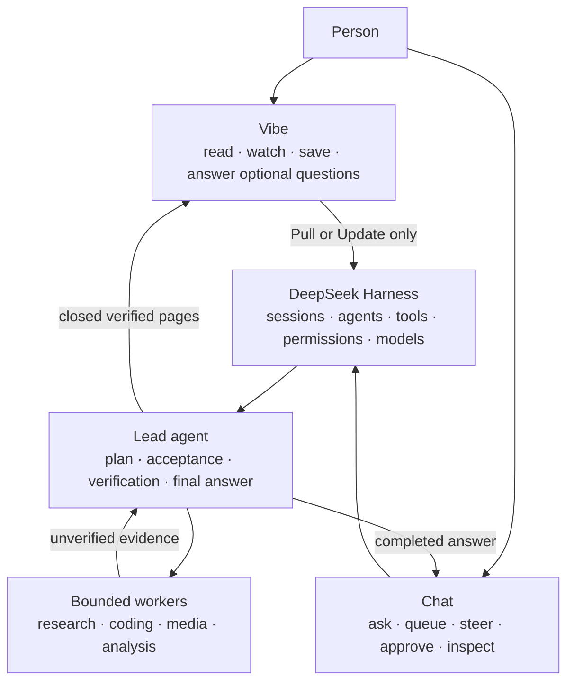
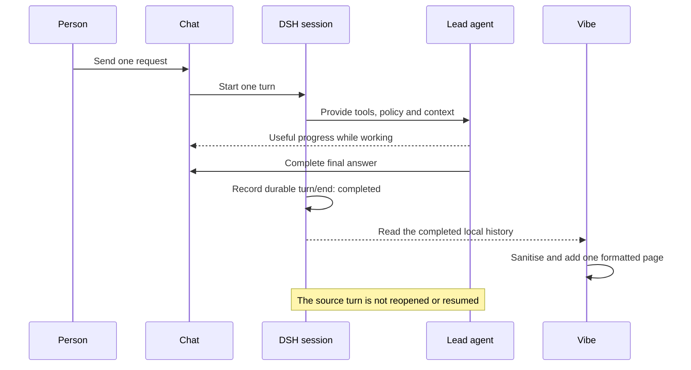
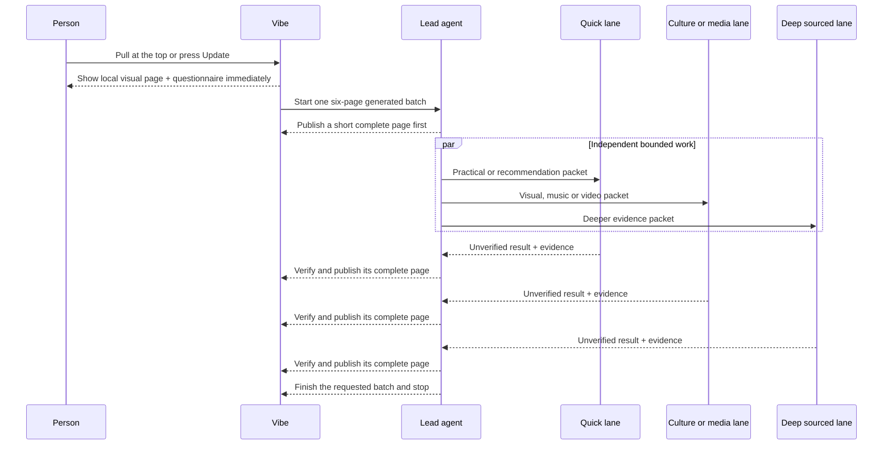

# How DSH Vibeify works

DSH Vibeify is a local agent harness presented as a living magazine. It is not a public website and it is not a chatbot that quietly runs forever. The visible **Vibe** surface is a browser-local edition; **Chat** is the control surface where a person asks for work, follows progress, steers it, and approves protected actions.

## The short version

Think of it as a small editorial studio:

- **Vibe is the magazine.** It opens with useful visual material already available from a local content well and the reader's saved edition.
- **Chat is the commissioning desk.** A request starts one agent turn. Its completed answer remains in Chat and may also become a formatted Vibe page.
- **Update asks for one new edition pass.** Vibe immediately spends one prepared visual page and one questionnaire from its local reserve, then starts one bounded generated batch.
- **The lead is the editor.** It plans, divides eligible work, verifies evidence, and decides what is safe and good enough to publish.
- **Workers are contributors.** DeepSeek or another available worker can research or build bounded pieces, but its raw report is never itself a Vibe article.
- **Finished pages stream independently.** A quick page does not wait for a deeper research lane. Each complete, checked page appears as soon as it is ready.
- **The run stops.** One Chat request produces one answer; one Vibe update produces one batch. Neither completion nor ordinary scrolling starts another run.

## Two surfaces, one harness



DSH remains the runtime underneath both surfaces. It owns the sessions, models, tools, permissions, approvals, and durable event history. Vibeify adds the presentation and the narrow publication rules; it does not bypass DSH.

## What happens when DSH opens

Vibe renders from local material before it needs a model or network request:

1. a bundled 24-item editorial well supplies a useful cold start;
2. up to 160 previously completed Vibe pages are restored from that browser's local cache;
3. the newest material is presented first; and
4. images below the fold load lazily.

Opening Vibe, returning to it, scrolling, reaching the bottom, or changing a colour theme makes **no model call**. Blank-content time is designed to be zero.

## What happens after a Chat request



Only a durably completed assistant turn is eligible. Vibe ignores the raw user prompt, hidden reasoning, tool calls, approvals, attachments, session identifiers, interrupted turns, aborted work, and internal subagent sessions. The original answer stays in Chat; the Vibe page is a bounded browser-local projection of completed material.

## What happens after Pull to update or Update

One deliberate gesture starts exactly one bounded magazine update.



The immediate visual page and questionnaire use no provider call and target a sub-second arrival. Generated work then follows progressively:

1. the lead publishes a small, honest page that does not require fresh research;
2. quick/practical, culture/media, and deeper sourced lanes can run concurrently;
3. each worker returns evidence to the lead, not directly to the reader;
4. the lead verifies each lane independently;
5. each finished page crosses a complete-envelope boundary and appears immediately; and
6. the parent update stops after the requested batch or after its safety timeout.

The browser never publishes half a paragraph or a stream of raw tokens. It waits only for one **complete semantic chunk**—a finished article, recommendation, image page, music or video route, editorial, or questionnaire—then releases that item without waiting for the whole batch.

## What runs, and what does not

| Reader action or event | Model work? | Visible result | Stop condition |
| --- | --- | --- | --- |
| Open or return to Vibe | No | Bundled and saved magazine appears | Immediate local render |
| Scroll or reach the bottom | No | Existing pages continue | No task started |
| Change colour theme | No | Presentation changes | Immediate |
| Change editorial direction | No | Setting is saved for a future update | Immediate |
| Complete a Chat request | No additional call beyond that requested Chat turn | Final answer stays in Chat and may gain a Vibe page | The Chat turn ends |
| Pull at the top or press **Update** | Yes, after two local pages | Two immediate pages, then six generated pages progressively | One batch, Stop, error, or 20-minute ceiling |
| Answer a questionnaire | No | The visible choice is saved locally | It may shape only a later requested update |

## Lead and worker modes

Vibeify supports three provider arrangements:

| Mode | Who leads? | How workers are used |
| --- | --- | --- |
| DeepSeek only | Native DSH/DeepSeek agent | DSH's native agent and approval boundaries apply; no Codex verification claim is made |
| ChatGPT only | ChatGPT-authenticated Codex | Codex plans, executes, verifies and answers |
| Both | Codex | Codex keeps planning and acceptance; DeepSeek performs eligible bounded work when that preserves the same evidence bar |

In combined mode, cheaper execution is not treated as trusted merely because it completed. Codex checks the actual file, diff, test, source, or other required artifact. Passing work is reused; failed or unverifiable work is repaired or rerun. Protected connected-app actions, privacy decisions, final acceptance, and the final answer stay with Codex.

The **Settings → Codex** capability level changes the Codex model and reasoning preset, not this responsibility split. Frontier remains the quality-preserving default.

## How a page crosses into Vibe

Generated pages use one closed transport envelope:

```text
<vibe-chunk id="one-update-unique-id" kind="article" title="A reader-facing title">
Complete Markdown for this one page, with relevant verified links.
</vibe-chunk>
```

The active-run collector accepts only:

- a fully closed envelope;
- an allowed page kind;
- an id belonging to the current update; and
- bounded, sanitized reader-facing fields.

Partial envelopes, raw worker reports, candidate lists, research memos, tool output, another run's pages, and ordinary update summaries are rejected. Persisted session history provides a lossless fallback if the live local event stream disconnects.

## Local storage and privacy

The magazine cache stays in the current browser. It retains only presentation data: a local or hashed id, page kind, source class, title, bounded Markdown, optional catalogue topic, publication time, and up to 32 visible questionnaire choices. Entries expire after 30 days and the oldest pages fall out after 160 items.

It does not store raw prompts, DSH session ids, account information, attachments, reasoning, tool calls, approval contents, credentials, or worker packets. Vibeify does not send current images or private project material to a different provider without explicit permission.

## Failures remain bounded

- If local storage is unavailable, the current in-memory edition still works.
- If saved data is corrupt, Vibe starts from the bundled well.
- If a worker fails, its page is omitted or replaced with a smaller honest page after lead checking.
- If the dedicated update cannot start, the existing magazine remains unchanged apart from the two already prepared local pages.
- **Stop update** cancels only the dedicated magazine turn.
- The 20-minute ceiling stops an abandoned update.
- No completion event schedules the next batch.

## Where to go next

- [Installation](INSTALL.md) — accounts, provider modes, updating, and removal.
- [Vibe magazine lifecycle](CONTENT_STREAMING.md) — the detailed product and engineering contract.
- [Architecture](ARCHITECTURE.md) — package, module, and provider boundaries.
- [Security, privacy, approvals, and billing](SECURITY.md) — what is protected and who can authorize it.
- [VIBEs](VIBES.md) — colour and editorial-direction customization.
