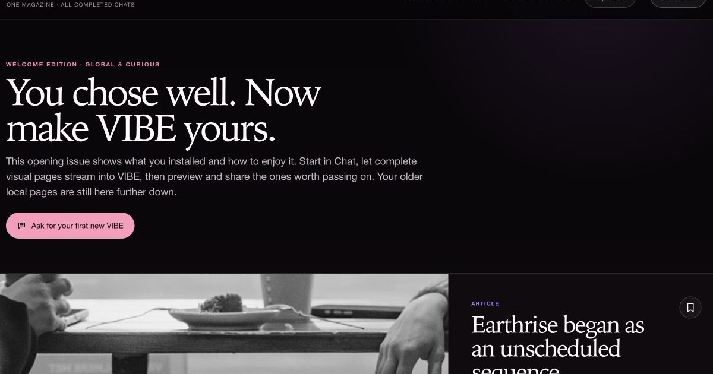

# I turned DeepSeek Harness from an empty prompt into a living magazine

Most AI products introduce themselves with a blank rectangle.

It is a surprisingly demanding welcome. Before the software has shown you anything useful, you must decide what to ask, phrase it well, and trust that the answer will be worth the wait. The machine may be astonishing, but the opening experience still feels like paperwork.

I wanted to try the opposite: open the product and find something worth reading.

That experiment became **DSH Vibeify**, an open-source magazine experience for [DeepSeek Harness](https://github.com/deepseek-ai/DeepSeek-Harness). It does not replace the harness or disguise it as an ordinary website. It gives the harness a different front door.

The result is Vibe: one visual, newest-first edition assembled from completed AI work, locally available welcome material, saved articles and deliberately requested updates. Chat is still there whenever I want to commission something, inspect progress, steer the work or approve an external action. It is simply no longer the whole product.

## The 72-second proof

The [public walkthrough](https://dsh-vibeify.ezzye.chatgpt.site/#demo) uses the real Vibeify interface. It shows four transitions that matter:

1. Vibe opens with visual content rather than an empty prompt.
2. A request in Chat becomes a finished magazine card.
3. **Update** begins one deliberate editorial pass instead of an endless background conversation.
4. **Preview and share** opens one private article preview; publication remains a separate choice.

That last distinction is important. The demo is not a mock-up of a future workflow. It is a short recording of the product boundary I wanted to make obvious.

## “Streaming” should mean more than watching words arrive

Token streaming solves one kind of waiting: it proves that a model has started speaking. It does not make a long answer easy to read, and it does not turn several parallel pieces of work into a coherent publication.

Vibeify streams **complete content items** instead. A short, verified card can appear while a deeper article is still being researched. Later cards arrive independently when they are ready. A slow lane does not need to hold a quick one hostage.

On launch, the edition can render from bundled and saved local material without calling a model. When I explicitly pull down or press **Update**, Vibe releases any ready reserve pages immediately. If that reserve is short, it may start one bounded foreground editorial turn. There is a visible **Stop update** control and a time limit; completing the turn cannot silently start another one.

This is less like waiting for a very long email and more like opening a magazine whose next pages are being laid out while I read the first ones.

The detailed lifecycle is documented in [How DSH Vibeify works](https://github.com/N9-Developer-Empowerment/DSH-Vibeify/blob/main/docs/HOW_IT_WORKS.md) and [Content streaming](https://github.com/N9-Developer-Empowerment/DSH-Vibeify/blob/main/docs/CONTENT_STREAMING.md).

## The harness still matters

The website-like surface is not the architecture. Underneath it, DeepSeek Harness still owns sessions, tools, provider connections, permissions and approvals.

Vibeify adds an editorial layer with three jobs:

- decide which completed material belongs in the magazine;
- present it as readable cards with useful links and relevant images;
- keep unfinished work, reasoning, prompts and approval details out of the reader surface.

That separation lets Vibe stay calm without pretending the machinery has disappeared. If I need detail, I open Chat. If an action needs approval, it still needs approval. If a worker says it has finished, the lead still has to check the result rather than accepting the claim as evidence.

## DeepSeek, ChatGPT, or both

Vibeify is not a disguised subscription funnel. It supports three honest arrangements:

- **DeepSeek only:** native DSH and DeepSeek remain in charge; the provider-neutral plugin supplies the Vibe experience.
- **ChatGPT only:** a ChatGPT-authenticated Codex agent leads without requiring an OpenAI API key.
- **Both:** Codex plans, sets acceptance criteria and verifies the result while DeepSeek handles eligible bounded execution.

Neither account is individually compulsory. At least one working provider is needed before asking the agent to perform new AI work, and the providers keep their own limits and charges.

The distinction also affects what the product may claim. In combined mode, a card can say that Codex checked bounded DeepSeek work only when that verification actually occurred. DeepSeek-only mode must not borrow that label.

## Local magazine, selective publication

My Vibe is not a hosted public profile. Its preferences, saved edition and editorial learning remain in the browser.

Sharing crosses a separate boundary:

1. I choose **Preview and share** on one finished article.
2. Vibeify sends an allow-listed presentation snapshot of that article to the fixed share service.
3. I inspect a private preview.
4. Only **Publish public link** creates an ordinary public page.

The transfer contract has no field for the Chat prompt, reasoning, session identity, approvals, attachments, selected tribes, local history or credentials. A recipient needs neither DSH nor an AI account to read the published page.

That is intentionally more awkward than a universal “make everything public” switch. The friction is the feature: publish the result I chose, not the workspace that produced it.

The exact boundary is documented in [Sharing one Vibe article](https://github.com/N9-Developer-Empowerment/DSH-Vibeify/blob/main/docs/SHARING.md) and [Security and billing](https://github.com/N9-Developer-Empowerment/DSH-Vibeify/blob/main/docs/SECURITY.md).

## What changed for me

The practical change was not that Chat became less useful. It became easier to use for its real job.

Chat is where I say, “Make a Vibe article explaining this,” ask a follow-up, redirect the editor, or approve a protected action. Vibe is where I read what survived that process. One is a control surface; the other is the publication.

That changes the starting question from “What should I type?” to “What is interesting here?”

It also creates a better demonstration of agent work. Instead of showing somebody a transcript full of tool calls and status messages, I can show the finished article. If it is genuinely useful, I can share that one page. Product proof becomes content rather than a screenshot of a settings panel.

## Try the different front door

DSH Vibeify is open source, macOS-first and still attached to a fast-moving developer preview. The Windows and Linux installers remain clearly labelled preview routes until they have passed on real representative machines. It is not fully offline, and provider work may carry separate costs.

Those caveats are less glamorous than “AI, reinvented.” They are also more useful.

If the idea interests you:

- [watch the real 72-second walkthrough](https://dsh-vibeify.ezzye.chatgpt.site/#demo);
- [read the source and documentation](https://github.com/N9-Developer-Empowerment/DSH-Vibeify);
- [download the current installer](https://dsh-vibeify.ezzye.chatgpt.site/#install).

Then try one explicit request in Chat: **“Make a Vibe article about something I care about.”**

The empty prompt is still available. It just no longer gets the best seat in the house.

---

*DSH Vibeify is an independent community project and is not an official DeepSeek or OpenAI product.*
